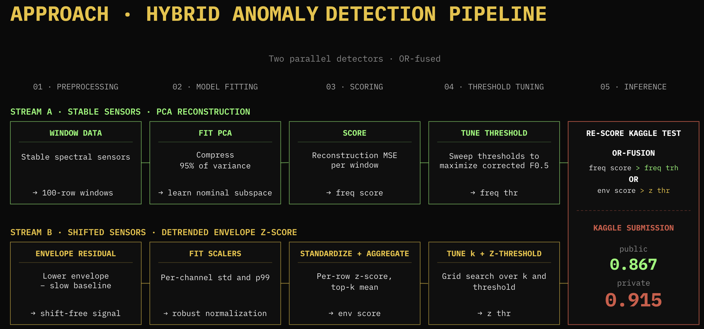

# SENTINEL

ESA Spacecraft Telemetry · Anomaly Detection · Mission 1

*Helena Schulz · Alex Federolf · Ekaterina Klemenkova · Christopher Ewen*<br>
*Le Wagon Data Science & AI Bootcamp - final project, 2026*

**Kaggle Competition:** [ESA-ADB Challenge](https://www.kaggle.com/competitions/esa-adb-challenge)<br>
Kaggle leaderboard private : **0.915** · public 0.867

**Full methodology:** [docs/results.md](docs/results.md)

**Live demo:** [sentinel-frontend.streamlit.app](https://sentinel-frontend.streamlit.app)


---

## Approach

The ESA-ADB Mission 1 dataset contains 14 years of real spacecraft telemetry - 76 sensor channels, 14.7M labeled rows, 190 anomaly events. The principal challenge is a non-stationary regime: ten sensor channels exhibit a lock-step baseline shift late in the training data that persists through the entire test set. Single-stream models trained on the early stable regime - including PCA, LSTM-AE, and CNN-AE baselines - flag the whole post-shift region as anomalous, and the event-wise F0.5 collapses.

The final model partitions the channel set by drift behavior and runs two specialized detectors in parallel:

**Stream A - PCA Reconstruction.** Operates on the stable spectral channels (41–46). PCA is fit on tail-50k nominal 100-row windows, retaining 95% of explained variance. Each window is scored by its reconstruction MSE.

**Stream B - Detrended Envelope Z-Score.** Operates on the drift-affected channels (14, 21, 29). A lower envelope (rolling minimum, window 200) isolates the anomaly-sensitive component; a centered moving-average subtraction (window 5,000) removes the slow baseline. The standardized residual is aggregated row-wise via top-k mean across channels.

Each stream has an independent threshold tuned on a held-out validation window via ESA-corrected event-wise F0.5. Detection is OR-fused at row level: a row is flagged if either stream exceeds its threshold.



Either stream alone reaches approximately 0.85 ESA F0.5 on validation; fused, the hybrid reaches 0.94. Channel partitioning is essential: PCA applied to the full 58-channel set floods on the drift-affected regions, while a z-score on the stable channels misses the spectral signal. Specializing each detector on its channel group yields independent error profiles whose union outperforms either detector alone.

---

## Setup

**Requirements:** Python 3.10.6, pyenv

```bash
# Clone and set up environment
git clone git@github.com:alexfederolf/sentinel.git
cd sentinel
pyenv virtualenv 3.10.6 sentinel
pyenv local sentinel
pip install --upgrade pip
pip install -r requirements.txt
pip install -e .

# Verify
python -c "from sentinel.ml_logic.metrics import corrected_event_f05; print('OK')"
```

---

## Quick start - local demo

Runs the production FE model locally as a FastAPI service. No data download needed - all artefacts are included in the repo.

**Model:** 46-channel detrended PCA (`models/pca_fe_46ch.pkl`)<br>
**Data:** 300 k-row demo slice (rows 14.175 M – 14.475 M of `train.parquet`, 6 events)

```bash
make run_api
# → http://localhost:8000/docs
```

---

## Quick start - reproduce the Kaggle champion

**Model:** Hybrid (PCA freq + detrended envelope z-score), see [`notebooks/11d-pca_hybrid_BEST.ipynb`](notebooks/11d-pca_hybrid_BEST.ipynb)<br>
**Data:** `train.parquet`, `test.parquet`, `target_channels.csv`, `sample_submission.parquet` from the [Kaggle competition page](https://www.kaggle.com/competitions/esa-adb-challenge) → `data/raw/`

```bash
# 1. Place the four files in data/raw/

# 2. Preprocess (generates data/processed/kaggle/*.npy)
make run_preprocess_kaggle

# 3. Run notebooks/11d-pca_hybrid_BEST.ipynb end-to-end
```

---

## Repo structure

```
src/sentinel/      Shared Python modules (preprocessing, scoring, metrics, predictor)
notebooks/         EDA, baselines, hybrid champion, FE model
api/               FastAPI service serving the FE model
models/            Trained artefacts (PCA, scaler, sidecar metadata)
data/              raw/ (download from Kaggle) · processed/ (generated by run_preprocess)
docs/              Full methodology - see docs/results.md
tests/             Unit tests for metrics, scorer, thresholds, predictor
scripts/           Build and verification scripts
```

---

## Key notebooks

All paths relative to `notebooks/`. EDA notebooks live in `notebooks/EDA/`.

| Notebook | Description |
|---|---|
| `EDA/01-eda.ipynb` | Signal EDA - component structure, anomaly characterisation |
| `EDA/18-level_shift_1.ipynb` | Shift analysis - identifies the 10 level-shifted channels |
| `EDA/ek_freq_eda.ipynb` | Frequency EDA - identifies channels 41–46 as stable spectral cluster |
| `ek_baseline_zscore.ipynb` | Detrended Envelope Z-Score - envelope residual + z-score stream |
| `02-preprocessing.ipynb` | Preprocessing pipeline walkthrough |
| `04-pca_1.ipynb` | PCA baseline with all 58 channels |
| `11d-pca_hybrid_BEST.ipynb` ⭐ | Hybrid: PCA reconstruction + Detrended Envelope Z-Score. Kaggle champion |
| `11e-pca_detrended_FE.ipynb` | FE model (46-channel detrended PCA) |
| `32-api.ipynb` | API showcase and diagnostics |
